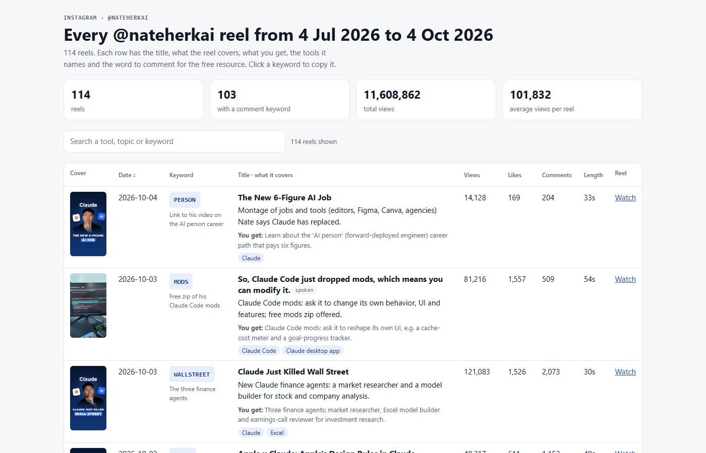

# Instagram Reel Index

A Claude Code skill that turns any Instagram creator's reels into one searchable overview. For every reel you get:
- the title and what it covers
- what you get out of it, and the tools it names
- the comment keyword for the free resource, with one-click copy
- views, likes, comments and length

Search by tool ("MCP", "Higgsfield"), sort by views, open the reel.

## Ready-made example: @nateherkai, 114 reels (4 Jul to 4 Oct 2026)

| File | What |
|---|---|
| [`examples/nateherkai/overview-standalone.html`](examples/nateherkai/overview-standalone.html) | The overview as one file (5.2 MB, covers inside). Open the link, click **Download raw file**, then double-click the file to open it in your browser |
| [`examples/nateherkai/overview.xlsx`](examples/nateherkai/overview.xlsx) | Excel with cover pictures, filters on every column, and a **Tools** sheet ranking every tool by how many reels name it |

Unofficial index of public posts, not made or endorsed by Nate Herk.

## Make your own for any account

### What you need

| | What | Cost |
|---|---|---|
| 1 | **Claude Code** (any paid Claude plan) | Your normal plan. Claude writes the titles and descriptions, which uses your usage limit |
| 2 | **Python 3** | Free. For the Excel file also run once: `pip install openpyxl pillow` |
| 3 | **Node.js** (only to install the Glasser command) | Free, nodejs.org |
| 4 | **A Glasser account with credit**: glasser.ai | Pay per call. The only paid outside tool. It fetches the posts and reel transcripts from Instagram |

You do **not** need Apify, an Instagram login, or any other API key.

**My experience with Glasser:** I'm testing it. You get **$1 of free credit** when you sign up, which already covers about 500 reels. I added another $10 to keep going.

### What it cost me

The @nateherkai example above, 114 reels:

| Item | Amount |
|---|---|
| Glasser calls | 125 (10 pages of posts + 114 transcripts + 1 test) at $0.00188 each |
| **Glasser total** | **$0.235** |
| **Per reel** | **about $0.002** (0.2 cents); 100 reels ≈ $0.20 |
| Claude | inside my normal plan, no extra bill. The two biggest writing steps (titles from the cover images, "what you get") took about 270,000 Sonnet tokens |

The skill tells you the expected cost and waits for your OK before it spends anything. Every call is logged with its price in `charges.log`.

### Install

1. On this page click **Code → Download ZIP** and unzip it.
2. Copy the folder `instagram-reel-index` into your Claude Code skills folder:
   - Windows: `C:\Users\<you>\.claude\skills\`
   - Mac/Linux: `~/.claude/skills/`
3. Install the Glasser command once: `npm install -g @glasser-ai/cli@latest`, then run `glasser balance` and log in when it asks.
4. Start Claude Code in any folder and say:
   **"Make an Instagram reel index for @nateherkai for the last 3 months"**

You get `overview.html`, `overview-standalone.html`, `overview.xlsx` and `overview.csv` in `instagram-index/<handle>/`.

### Good to know

- Public posts only. Use it for your own research.
- Covers are downloaded on the day you scrape, because Instagram's image links expire after a few days. The script does this for you.
- Re-running continues where it stopped and does not pay twice for what is already downloaded.

## How it works

| Step | Script | What it does |
|---|---|---|
| 1 | `scripts/scrape.py` | Posts, reel transcripts and covers through Glasser (ScrapeCreators); logs every charge |
| 2 | `scripts/prepare.py` | Bundles caption, transcript and the caption keyword per reel |
| 3 | Claude | Writes `notes.json`: title (read from the cover), what it covers, what you get, tools, keyword, freebie |
| 4 | `scripts/build.py` | Builds the HTML overview and CSV (`--embed` for the single-file version) |
| 5 | `scripts/excel.py` | Builds the Excel file |

Full instructions for Claude are in [`instagram-reel-index/SKILL.md`](instagram-reel-index/SKILL.md).
